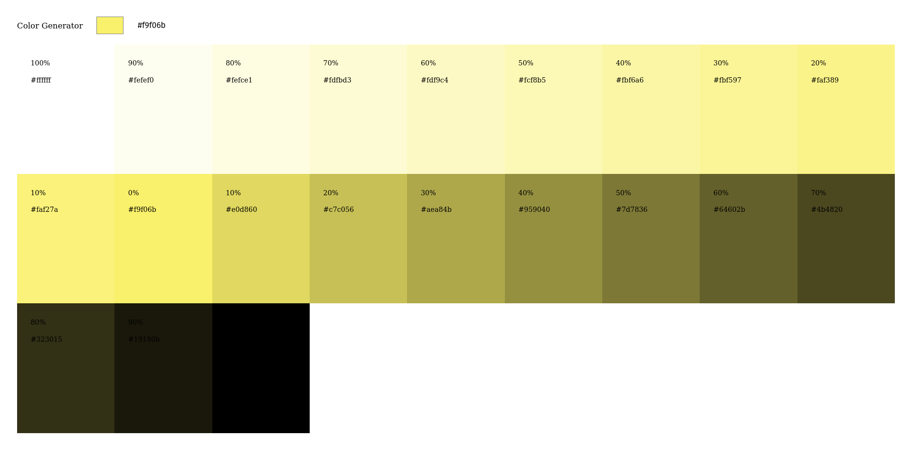

# Color Generator in Svelte

A Svelte port of [john-smilga/react-vite-projects-9-color-generator](https://github.com/john-smilga/react-vite-projects-9-color-generator)

Made for learning purposes.

## Installation

```bash
git clone https://github.com/Delta456/svelte-color-generator
cd svelte-color-generator
npm run dev
```

## Screenshots

|                                             |                                     |     |
| :-----------------------------------------: | :---------------------------------: | :-: |
|     |    |
|  |  |

## License

Licensed under [MIT](./LICENSE).
